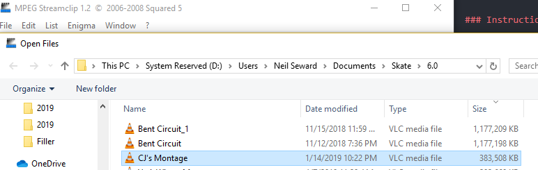
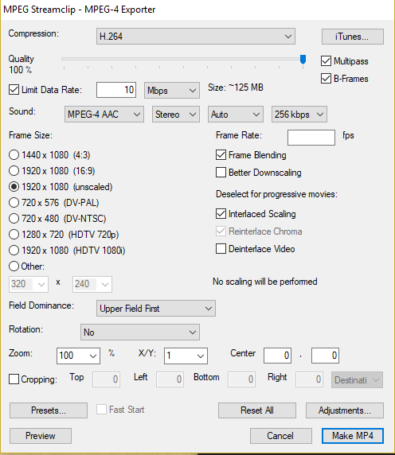
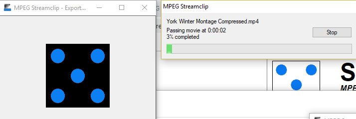

# mpeg-streamclip-settings
Repo to hold memo on compressing H.264 video with MPEG Streamclip

### Setup

1. Export full video from editor, preferably already in H.264 format (mp4).
2. Download and install [MPEG Streamclip](http://www.squared5.com/)

### Instructions

1. Open MPEG Streamclip.
2. Open exported video. This should be very large.

3. Go to File > Export to MPEG-4.
4. Use the following settings:
- Compression: H.264
- Quality: 100
- Limit Data Rate: 10 **Mbps**
- Multipass: `[x]`
- B-Frames: `[x]`
- Frame Blending: `[x]`
- Interlaced Scaling: `[x]`
- Frame Size: 1920x1080 (unscaled)

5. Make MP4. You should see this below.

