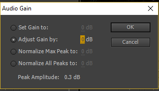

# adjusting-audio

### Setup

1. Open Premiere Pro project.
2. Open sequence.

### Instructions

1. Right click on video/audio file.
2. Go to `Audio Gain...`
3. Adjust gain + to increase sound.
4. Adjust gain - to decrease sound.

### Common Sound Transitions

1. Constant Power
2. Exponential Fade
