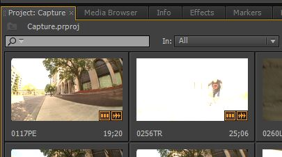
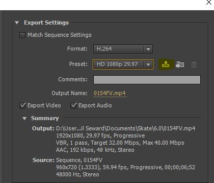

# Importing/Capturing Footage

- Import the clips from the P2 drive into your project.
- In this form, you will need to export the individual clip as a sequence in order to collapse the 4 audio channels to one.

### Steps

1. Right click the clip that has been imported to the project window and select Create New Sequence From Clip.

2. Go to `File > Export > Media`

4. Select `H.264` and the Preset should be `HD 1080p 29.97`

5. If you would like to save the preset under a custom label, select the down arrow towards disk to save the preset. You may use this in the future to quicken the process.

6. Hit export.
