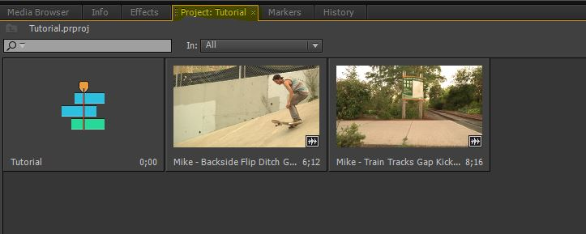
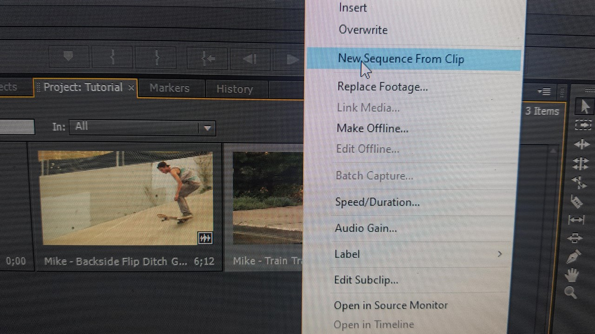
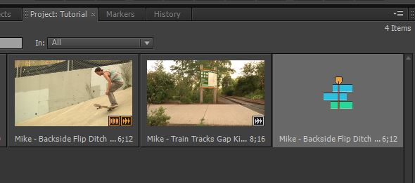

# Creating a New Sequence From Clip

Especially when you are capturing footage, you will want to export individual clips instead of all at once. For each clips you want to export individually, you will need to follow these steps.

1. Open your project

2. Bring in the raw files, or already exported files (doesn't matter for the purposes of this).

3. Make sure you are in the Project window.

4. Right click the clip you want to export. Do not select more than one clip at a time. Select the New Sequence From Clip option.

5. You should now have a new sequence with the same as the clip you want to export. If there are more than one clip present in the sequence, you don't have the new sequence selected. Go back to the Project window and select the sequence with the same name as the clip you want exported.

6. Congrats, you can now [export](https://github.com/sealneaward/editing-video-memos/blob/master/import-settings.md).
